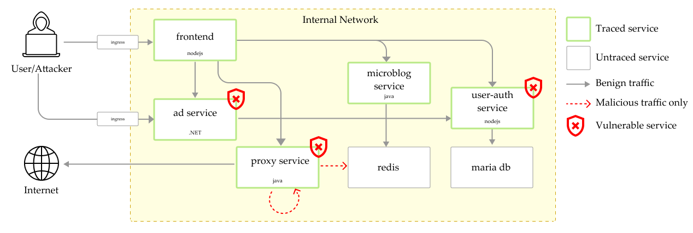

#  Unguard

**Unguard** (🇦🇹 [ˈʊnˌɡuːat] like disquieting, 🇫🇷 [ãˈɡard] like the fencing command) is an insecure cloud-native microservices demo application. It consists of six app services, a load generator, and two databases. Unguard encompasses vulnerabilities like SSRF and comes with built-in Jaeger traces. The application is a web-based Twitter clone where users can:

- register/login (without any passwords)
- post text and URLs with previews
- view global or personalized timelines
- see ads on the timeline (currently only a static image)
- view user profiles
- follow other users

## 🏗️ Architecture

Unguard is composed of six microservices written in different languages that talk to each other over REST.



| Service                                  | Language        | Description                                                                                                  |
| ---------------------------------------- | --------------- | ------------------------------------------------------------------------------------------------------------ |
| [ad-service](./ad-service)               | .NET 5          | Serves a HTML page with an static image.                                                                              |
| [frontend](./frontend)                   | Node.js Express | Serves HTML to the user to interact with the application.                                                     |
| [load-generator](./load-generator)       | Python/Locust   | Creates synthetic user traffic.                                                                               |
| [microblog-service](./microblog-service) | Java Spring     | Serves REST API for frontend, saves data into redis.                                                          |
| [proxy-service](./proxy-service)         | Java Spring     | Serves REST API for proxying requests from frontend (vulnerable to SSRF; no sanitization on the entered URL). |
| [user-auth-service](./user-auth-service) | Node.js Express | Serves REST API for authenticating users with JWT tokens (vulnerable to JWT key confusion).                   |
| jaeger                                   |                 | The [Jaeger](https://www.jaegertracing.io/) stack for distributed tracing.                                    |
| mariadb                                 |                 | Relational database that holds user and token data.                                                           |
| redis                                    |                 | Key-value store that holds all user data (except authentication-related stuff).                               |

## ☸️ Kubernetes Deployment

### 🗒️ Requirements

The following tools are required for all deployment options:

* [kubectl](https://kubernetes.io/docs/tasks/tools/)
* [helm](https://helm.sh/docs/intro/install/)
* [skaffold](https://skaffold.dev/docs/install/)
* [kustomize](https://kustomize.io/)
* [OpenJDK11](https://jdk.java.net/archive/)

Add the necessary Helm repositories and fetch updates:

```sh
helm repo add jaegertracing https://jaegertracing.github.io/helm-charts
helm repo add bitnami https://charts.bitnami.com/bitnami
helm repo add falcosecurity https://falcosecurity.github.io/charts
helm repo update
```

### ⛵ Minikube or Kind Deployment

This is the recommended way of running Unguard on a local machine.

1.  **Install prerequisites**

    Follow the instructions to install one of the following on your system:

    * [minikube](https://minikube.sigs.k8s.io/docs/start/) if you want a cluster in a VM (slow on Windows)
    * [kind](https://kind.sigs.k8s.io/) if you want a cluster in a Docker container

2.  **Start a new or existing cluster with the ingress add-on enabled**

    This will create a new minikube profile (i.e. cluster) named "unguard".

    ```sh
    minikube start --addons=ingress --profile unguard
    # 🍎 for macOS a vm-based driver is needed (https://github.com/kubernetes/minikube/issues/7332)
    minikube start --addons=ingress --profile unguard --vm=true
    ```

    Alternatively, create a new kind cluster named "unguard".

    ```sh
    kind create cluster --name unguard
    ```

3.  **(Optionally) Add image pull secrets to your cluster service accounts**

    Due to the great number of image pulls required you might need to set secrets for
    an authenticated image repository to avoid being [rate-limited by DockerHub](https://www.docker.com/increase-rate-limits).

    ```sh
    kubectl create secret docker-registry unguard-docker-hub-secrets
        --docker-server=docker.io \
        --docker-username=DUMMY_USERNAME \
        --docker-password=DUMMY_DOCKER_ACCESS_TOKEN \
        --docker-email=DUMMY_DOCKER_EMAIL
    ```

    Patch the default service account (and the one used by the Jaeger operator) to use these pull secrets.

    🐧 On Linux, use the following

    ```sh
    kubectl patch serviceaccount default -p '{"imagePullSecrets": [{"name": "unguard-docker-hub-secrets"}]}'
    kubectl patch serviceaccount jaeger-operator -p '{"imagePullSecrets": [{"name": "unguard-docker-hub-secrets"}]}'
    ```

    💻 On Windows, use the following

    ```sh
    kubectl patch serviceaccount default -p '{\"imagePullSecrets\": [{\"name\": \"unguard-docker-hub-secrets\"}]}'
    kubectl patch serviceaccount jaeger-operator -p '{\"imagePullSecrets\": [{\"name\": \"unguard-docker-hub-secrets\"}]}'
    ```

    > Note: This needs to be done every time you recreate the cluster. You might need to repeat those steps once you deploy additional charts, e.g. for `jaeger`, `jaeger-operator`, `unguard-mariadb` at the moment.

4.  **Build and run Unguard with [Skaffold](https://skaffold.dev/)**

    We grab the Docker daemon from the cluster first, so that we push the built images already into the cluster.

    🐧 On Linux with minikube, use the following

    ```sh
    eval $(minikube -p unguard docker-env)
    skaffold run --detect-minikube
    ```
    🍎 On macOS with minikube, use the following

    ```sh
    source <(minikube docker-env -p unguard)
    skaffold run --detect-minikube
    ```

    💻 On Windows with minikube, use the following with PowerShell

    ```sh
    & minikube -p unguard docker-env | Invoke-Expression
    skaffold run --detect-minikube
    ```

    With a kind cluster, simply run the following.
    Built images will be moved to the kind cluster automatically.

    ```sh
    skaffold run
    ```

5. **(Optionally) Deploy Falco or Jaeger**

    Add the dedicated profiles to the skaffold command, so that Falco and/or Jaeger is also deployed:

    ```sh
    skaffold run -p falco,jaeger
    ```

6.  **(Optionally) Expose the application to your local machine**

    To access the frontend, you can use port-forwarding.
    This is the recommended way as exposing the service to external traffic would be a bad idea.

    ```sh
    # exposes the frontend on localhost:3000
    kubectl port-forward -n unguard service/unguard-frontend 3000:80
    ```

    To make non-blind SSRF exploits, you can expose the proxy-service as well.
    This would be common practice with applications where the browser makes the requests (like Angular / React / Vue etc.).

    ```sh
    # exposes the proxy-service on localhost:8081
    kubectl port-forward -n unguard service/unguard-proxy-service 8081:80
    ```
    
    Currently, the ad-service has to be exposed to the end-user just like the frontend.
    For usage in the cloud, an ingress needs to be set up. (TODO [CASP-10192](https://dev-jira.dynatrace.org/browse/CASP-10192))
    ```sh
    kubectl port-forward -n unguard service/unguard-ad-service 8082:80
    ```

    To access the Jaeger UI you can expose it as well.
    ```sh
    # exposes the Jaeger UI on localhost:16686
    kubectl port-forward -n unguard service/jaeger-query 16686:16686
    ```

7.  **(Optionally) Expose the application to the internet**

    Use the [`k8s-manifests/extra/ingress.yaml`](./k8s-manifests/extra/ingress.yaml) as a template
    and possibly change the `unguard.kube` hostname to match the hostname of your deployment before applying it.

    ```sh
    kubectl apply -f k8s-manifests/extra/ingress.yaml
    ```

    Finally, you have to forward incoming requests to your machine on port 80 to your minikube on port 80.
    One way to do this is with the help of `socat` that you can start in a background `tmux` sessions.
    Make sure that your local firewall also allows connections on port 80, if you have one.

    ```sh
    sudo socat TCP-LISTEN:80,fork TCP:$(minikube ip):80
    ```

    > Note: This will not expose the proxy-service.

### ☁ AWS Deployment

1. **Ensure that the ECR repositories are already created**

    ```sh
    terraform -chdir=infrastructure init
    terraform -chdir=infrastructure apply -auto-approve
    ```

2. **Update Kube Config and login to ECR**

    ```sh
    aws eks update-kubeconfig --name <cluster-name> --region us-east-1 --profile dtRoleAccountAdmin
    ```

    ```sh
    aws ecr get-login-password --region us-east-1 --profile dtRoleAccountAdmin | docker login --username AWS --password-stdin <aws_account_id>.dkr.ecr.us-east-1.amazonaws.com
    ```

3. **Deploy to AWS**

    The AWS profile already comes with built-in Jaeger and an ingress which is only reachable from the Dynatrace VPN.
    
    ```sh
    skaffold run -p aws --default-repo <aws_account_id>.dkr.ecr.region.amazonaws.com
    # For Falco and Jaeger add the corresponding profile
    skaffold run -p aws,falco,jaeger --default-repo <aws_account_id.dkr>.ecr.region.amazonaws.com
    ```

4. **Update the application detection rule**

Redeploying the ingress can result in a new frontend hostname. Therefore, you have to update the [application detection rule](https://rjc90872.sprint.dynatracelabs.com/#settings/rum/webappmonitoring) in Dynatrace manually.

To get the hostname run the following command:

```sh
kubectl get ingress -n unguard unguard-ingress -o=jsonpath='{.status.loadBalancer.ingress[0].hostname}'
```

### 🔼 Push to Dynatrace Registry

```sh
skaffold run --default-repo registry.lab.dynatrace.org/casp
```

## 🖥️ Local Deployment

A local deployment is not supported because most services rely on the K8S domain name service.
If you must deploy some parts of the application locally, read the READMEs of the individual services.
