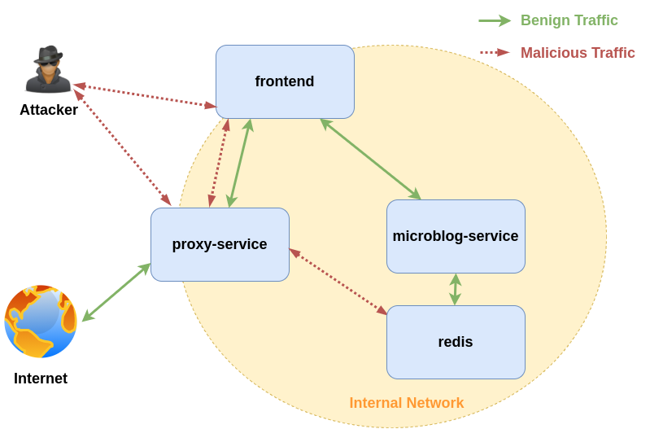

#  Vogelgrippe
A SSRF vulnerable twitter-clone consisting of several microservices designed to run 
on Kubernetes. It comes with Jaeger traces build in.

It allows users to 
* register / login (without any passwords)
* post text
* post URLs with URL preview
* view global/personalized timelines 
* view user profiles
* follow other users

The URL preview feature is SSRF vulnerable on purpose.

## Architecture

Vogelgrippe consists of 3 main services and a Redis key-value store used as a database:
* frontend (NodeJS Express app)
    * Serves HTML to the user to interact with the application
* microblog-service (Java Spring)
    * Serves REST API for fronend, saves data into redis
* redis (Redis key-value store)
    * Holds all the user data
* proxy-service (Java Spring)
    * Serves REST API for proxying requests from fronend 
    (SSRF vulnerable, does not do sanitization on the entered URL)




## Running on minikube 

This is the recommended way of running Vogelgrippe and requires you to have 
[minikube](https://minikube.sigs.k8s.io/docs/) installed.

1. **Start a new or existing minikube cluster with the ingress add-on enabled for 
Jaeger tracing.**
    
    ```
    # This will create a new minikube profile (i.e. cluster) named "vogelgrippe"
    minikube start --addons=ingress --profile vogelgrippe --kubernetes-version=v1.19.2
    ```


2. **Install Jaeger**

    Install the Jaeger operator with [helm](https://helm.sh/docs/intro/install/):
    
    ```
    # Add the repo
    helm repo add jaegertracing https://jaegertracing.github.io/helm-charts
    # Install the operator
    helm install jaeger-operator jaegertracing/jaeger-operator
    ```
    
    After installing the operator, you can create a ```jaeger.yaml``` file
    with the following contents: 
    
    ```
    apiVersion: jaegertracing.io/v1
    kind: Jaeger
    metadata:
      name: jaeger
    ```
    And apply it to get Jaeger running in you cluster.
    
    ```
    kubectl apply -f jaeger.yaml
    ```
    
    > Note: Make sure to name your Jaeger instance "```jaeger```" or 
    > adjust all the ```JAEGER_AGENT_HOST``` environment variables in 
    > ```/k8s-manifests``` to be of format ```{YOUR-NAME}-agent```

3. **Run the Vogelgrippe application with [Skaffold](https://skaffold.dev/)**

    ```
    # Use docker environment of you cluster
    eval $(minikube -p vogelgrippe docker-env)
    # Run the application
    skaffold run --detect-minikube
    ```
    
    To access the frontend, you can use port-fowarding.
    This is the recommended way as exposing the service to external traffic would be a bad idea.
    
    ```
    # Exposes the frontend on localhost:3000
    kubectl port-forward service/vogelgrippe-frontend 3000:80
    ```
    
    To make non-blind SSRF exploits, you can expose the proxy-service as well.
    This would be common practice with applications where the browser makes the requests (like Angular / React / Vue etc.).
    
    ```
    # Exposes the proxy-service on localhost:8081
    kubectl port-forward service/vogelgrippe-proxy-service 8081:80
    ```

## Running locally

### Requirements

Beside the 3 services, a Jaeger deployment is recommended as all the services send traces.

For setting up Jaeger, please see their [documentation](https://www.jaegertracing.io/docs/1.20/getting-started/).
The simplest way to start all needed Jaeger components is with Docker:

```
docker run -d --name jaeger \
  -e COLLECTOR_ZIPKIN_HTTP_PORT=9411 \
  -p 5775:5775/udp \
  -p 6831:6831/udp \
  -p 6832:6832/udp \
  -p 5778:5778 \
  -p 16686:16686 \
  -p 14268:14268 \
  -p 14250:14250 \
  -p 9411:9411 \
  jaegertracing/all-in-one:1.20
```

### Start microservices

Follow instructions in the READMEs of the 3 services to run all of the locally:
* frontend
* microblog-service
* proxy-service


