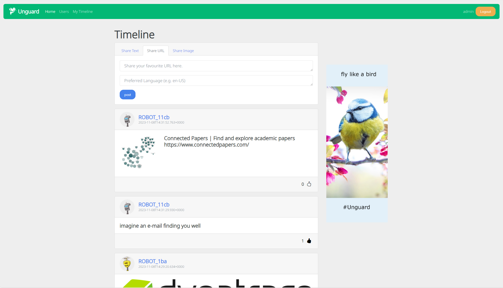

#  Unguard

**Unguard** (🇦🇹 [ˈʊnˌɡuːat] like disquieting, 🇫🇷 [ãˈɡard] like the fencing command) is an insecure cloud-native microservices demo application. It consists of six app services, a load generator, and two databases. Unguard encompasses vulnerabilities like SSRF and comes with built-in Jaeger traces. The application is a web-based Twitter clone where users can:

- register/login (without any passwords)
- post text and URLs with previews
- view global or personalized timelines
- see ads on the timeline (currently only a static image)
- view user profiles
- follow other users

## 🖼️ Screenshots

| Timeline | User profile |
| -------- | ------------ |
| [](./docs/images/unguard-timeline.png) | [](./docs/images/unguard-user-profile.png) |

## 🏗️ Architecture

Unguard is composed of six microservices written in different languages that talk to each other over REST.


| Service                                  | Language        | Description                                                                                                                                 |
| ---------------------------------------- | --------------- | ------------------------------------------------------------------------------------------------------------------------------------------- |
| [ad-service](src/ad-service)               | .NET 5          | Provide CRUD operation for images and serves a HTML page which displays an image like an ad.                                                |
| [frontend](./frontend)                   | Node.js Express | Serves HTML to the user to interact with the application.                                                                                   |
| [user-simulator](src/user-simulator)       | Node.js Element | Creates synthetic user traffic by simulating an Unguard user using a real browser. Acts as a load generator.                                |
| [microblog-service](src/microblog-service) | Java Spring     | Serves a REST API for the frontend and saves data into redis (explicitly calls vulnerable functions of the jackson-databind library 2.9.9). |
| [proxy-service](src/proxy-service)         | Java Spring     | Serves REST API for proxying requests from frontend (vulnerable to SSRF; no sanitization on the entered URL).                               |
| [user-auth-service](src/user-auth-service) | Node.js Express | Serves REST API for authenticating users with JWT tokens (vulnerable to JWT key confusion).                                                 |
| jaeger                                   |                 | The [Jaeger](https://www.jaegertracing.io/) stack for distributed tracing.                                                                  |
| mariadb                                  |                 | Relational database that holds user and token data.                                                                                         |
| redis                                    |                 | Key-value store that holds all user data (except authentication-related stuff).                                                             |

## 🖥️ Local Deployment

See the [Development Guide](./docs/DEV-GUIDE.md) on how to develop Unguard on a local K8S cluster.

## ☸️ AWS Quickstart

This guide assumes that an EKS cluster (and ECR repositories) already exist.  
If they don't, head to the [Terraform Guide](./docs/TERRAFORM.md) for more.

### 🗒️ Prerequisites

* [Docker](https://www.docker.com/products/docker-desktop)
* [Kubectl](https://kubernetes.io/docs/tasks/tools/), [Helm](https://helm.sh/docs/intro/install/), [Skaffold](https://skaffold.dev/docs/install/), and [Kustomize](https://kubernetes-sigs.github.io/kustomize/installation/)
* [AWS CLI](https://aws.amazon.com/cli/)

### ⛵ AWS [EKS](https://aws.amazon.com/eks/) Deployment

1. Pull AWS configuration via [ACE UPM](https://internal.ace-tools.dynatrace.com/upm/me/dashboard) (see [here](https://dev-wiki.dynatrace.org/x/wx6jF) for your first-time setup).

2. Let `aws` update your kubeconfig to be connected to EKS.
   This command will also return you the account ID that you need in the next step.
   It is encoded in the ARN ` arn:aws:eks:${REGION}:${AWS_ACCOUNT_ID}:cluster/${CLUSTER_NAME}`.

   ```sh
   aws eks update-kubeconfig --name ${CLUSTER_NAME} --region ${REGION}
   ```

3. Let `aws` log you into your ECR repository so that Docker pushes images to that.

   ```sh
   aws ecr get-login-password --region ${REGION} | docker login --username AWS --password-stdin ${AWS_ACCOUNT_ID}.dkr.ecr.${REGION}.amazonaws.com
   ```

4. Deploy to AWS. This might take up to 30 minutes for a cold build.

   ```sh
   # do a standard deployment
   skaffold run -p aws --default-repo ${AWS_ACCOUNT_ID}.dkr.ecr.${REGION}.amazonaws.com

   # for extra services add the corresponding profile
   skaffold run -p aws,falco,jaeger --default-repo ${AWS_ACCOUNT_ID}.ecr.${REGION}.amazonaws.com
   ```

 5. (Optional) Configure AWS Route 53 DNS entry. This is only necessary if the load balancer has been removed and recreated and is done through the UI. Within the AWS Console, follow these steps:
     * Go to the Route 53 console.
     * Open the hosted zone that you want to configure.
     * Edit the existing entry or create a new entry with:
         * Record Name: _choose a name_
         * Route traffic to: "Alias to Application and Classic Load Balancer"
         * Region: ${REGION}
         * Load Balancer: _select the AWS load balancer of unguard_

## ❄️ Dynatrace Monaco

Configuration for the unguard managment zone is at [`monaco/management-zone`](monaco/management-zone/management-zone.yaml).  
For setup, read the [official Monaco docs](https://dynatrace-oss.github.io/dynatrace-monitoring-as-code/) or [this wiki page](https://dev-wiki.dynatrace.org/x/QNBVEw).

## 💫 Versioning

See [this wiki page](https://dev-wiki.dynatrace.org/x/QZRhF).

## ✨ Features

* **[Kubernetes](https://kubernetes.io/) / [AWS](https://aws.amazon.com/eks)**: The app is designed to run on a local Kubernetes cluster, as well as on the cloud with AWS.
* [**Jaeger Tracing**](https://www.jaegertracing.io/): Most services are instrumented using trace interceptors.
* [**Skaffold**](https://skaffold.dev/): Unguard is deployed to Kubernetes with a single command using Skaffold.
* **Synthetic Load Generation**: The application comes with a deployment that creates traffic using the [Element](https://element.flood.io/) browser-based load generation library.
* **[Exploits](./exploits/tool/README.md)**: Different automated attack scenarios like JWT key confusion attacks or remote code execution.

## ➕ Additional Deployment Options

* **Falco**: [See these instructions](./docs/FALCO.md)
* **Jaeger**: [See these instructions](./docs/JAEGER.md)

---

[Hummingbird](https://thenounproject.com/search/?q=hummingbird&i=4138237) icon by Danil Polshin from [the Noun Project](https://thenounproject.com/).