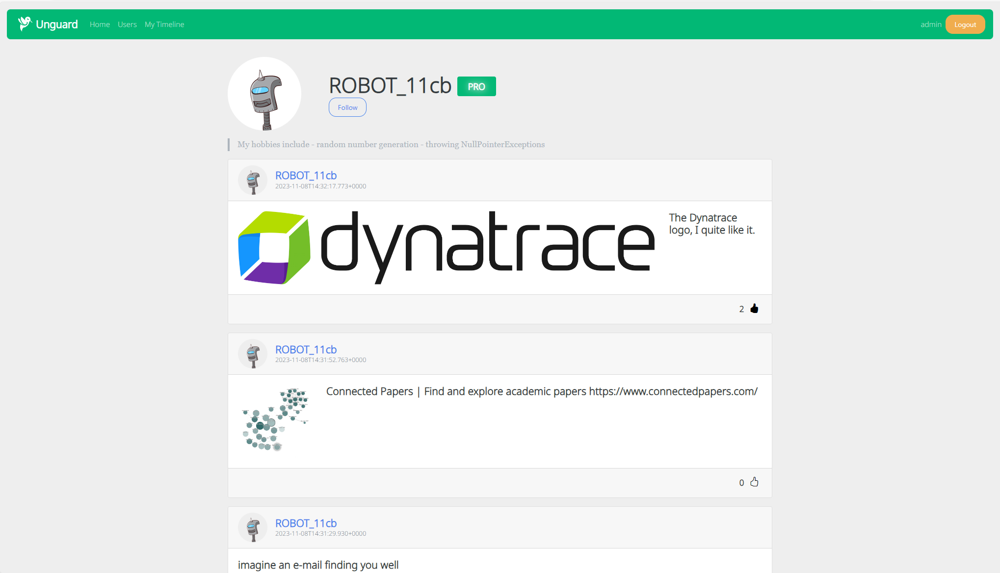
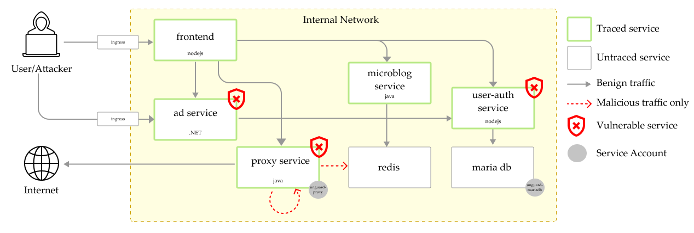

#  Unguard

**Unguard** (🇦🇹 [ˈʊnˌɡuːat] like disquieting, 🇫🇷 [ãˈɡard] like the fencing command) is an insecure cloud-native microservices demo application. It consists of six app services, a load generator, and two databases. Unguard encompasses vulnerabilities like SSRF and comes with built-in Jaeger traces. The application is a web-based Twitter clone where users can:

- register/login (without any passwords)
- post text and URLs with previews
- view global or personalized timelines
- see ads on the timeline (currently only a static image)
- view user profiles
- follow other users

## 🖼️ Screenshots

| Timeline | User profile |
|---|---|
| [](./docs/images/unguard-timeline.png) | [](./docs/images/unguard-user-profile.png) |

## 🏗️ Architecture

Unguard is composed of six microservices written in different languages that talk to each other over REST.



| Service                                  | Language        | Description                                                                                                  |
| ---------------------------------------- | --------------- | ------------------------------------------------------------------------------------------------------------ |
| [ad-service](./ad-service)               | .NET 5          | Provide CRUD operation for images and serves a HTML page which displays an image like an ad. |
| [frontend](./frontend)                   | Node.js Express | Serves HTML to the user to interact with the application.                                                     |
| [load-generator](./load-generator)       | Python/Locust   | Creates synthetic user traffic.                                                                               |
| [microblog-service](./microblog-service) | Java Spring     | Serves a REST API for the frontend and saves data into redis.                                                          |
| [proxy-service](./proxy-service)         | Java Spring     | Serves REST API for proxying requests from frontend (vulnerable to SSRF; no sanitization on the entered URL). |
| [user-auth-service](./user-auth-service) | Node.js Express | Serves REST API for authenticating users with JWT tokens (vulnerable to JWT key confusion).                   |
| jaeger                                   |                 | The [Jaeger](https://www.jaegertracing.io/) stack for distributed tracing.                                    |
| mariadb                                  |                 | Relational database that holds user and token data.                                                           |
| redis                                    |                 | Key-value store that holds all user data (except authentication-related stuff).                               |

## 🖥️ Local Development

If you would like to deploy the application on a local cluster, see the [Development Guide](./docs/DEV-GUIDE.md) on how to build this demo locally.

## ☸️ Quickstart (AWS)

> Note: `kubectl` must be configured to use the correct cluster.

1. **Clone the repository**

   ```sh
   git clone https://bitbucket.lab.dynatrace.org/scm/casp/ms-app-unguard.git
   cd ms-app-unguard
   ```

2. **Ensure that the ECR repositories are created**

   ```sh
   terraform -chdir=infrastructure init
   terraform -chdir=infrastructure apply -auto-approve
   ```

3. **Update your kubeconfig**

   ```sh
   aws eks update-kubeconfig --name <cluster-name> --region <region>
   ```
   
4. **Login to ECR**
   
   ```sh
   aws ecr get-login-password --region <region> | docker login --username AWS --password-stdin <aws_account_id>.dkr.ecr.<region>.amazonaws.com
   ```

5. **Deploy to AWS**
   
   The AWS profile already comes with an ingress which is only reachable from the Dynatrace VPN.
    
   ```sh
   skaffold run -p aws --default-repo <aws_account_id>.dkr.ecr.<region>.amazonaws.com
   # for extra services add the corresponding profile
   skaffold run -p aws,falco,jaeger --default-repo <aws_account_id.dkr>.ecr.<region>.amazonaws.com
   ```

## ☸️ Quickstart (GCP)

TODO: Update Description of deployment here. (APM-336273)

## ❄️ Dynatrace Monaco

The configuration file for creating an unguard managment-zone is placed in `monaco/management-zone`.  
For more infos regarding the deployment check the official monaco [Github](https://github.com/dynatrace-oss/dynatrace-monitoring-as-code) or our [wiki page](https://dev-wiki.dynatrace.org/pages/viewpage.action?pageId=324390976).

For a detailed step by step guide, how to deploy this monaco configs [read here](https://dev-wiki.dynatrace.org/pages/viewpage.action?pageId=324390976).

## 💫 Versioning
For further information about the unguard-versioning [look here](https://dev-wiki.dynatrace.org/display/CASP/Unguard%3A+Versioning).

## ✨ Features

* **[Kubernetes](https://kubernetes.io/) / [AWS](https://aws.amazon.com/eks)**: The app is designed to run on a local Kubernetes cluster, as well as on the cloud with AWS.
* [**Jaeger Tracing**](https://www.jaegertracing.io/): Most services are instrumented using trace interceptors.
* [**Skaffold**](https://skaffold.dev/): Unguard is deployed to Kubernetes with a single command using Skaffold.
* **Synthetic Load Generation**: The application comes with a deployment that creates traces using the [Locust](https://locust.io/) load generator.
* **[Exploits](./exploits/README.md)**: Different automated attack scenarios like JWT key confusion attacks or remote code execution.

## ➕ Additional Deployment Options

* **Falco**: [See these instructions](./docs/FALCO.md)
* **Jaeger**: [See these instructions](./docs/JAEGER.md)

---

[Hummingbird](https://thenounproject.com/search/?q=hummingbird&i=4138237) icon by Danil Polshin from [the Noun Project](https://thenounproject.com/).
