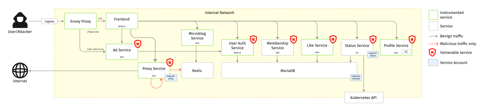

#  Unguard

**Unguard** (🇦🇹 [ˈʊnˌɡuːat] like disquieting, 🇫🇷 [ãˈɡard] like the fencing command) is an **insecure** cloud-native
microservices demo application. It consists of eight app services, a load generator, and two databases. Unguard
encompasses vulnerabilities like server-side request forgery (SSRF), Command/SQL injection, JWT key confusion,
remote code execution and many more.

The application is a web-based Twitter clone where users can register/login, post text, URLs and images and follow users.
Unguard also features fake ads, a possibility to edit your biography and manage your membership.

> **Note**
> This product is not officially supported by Dynatrace

## 🖼️ Screenshots

| Timeline                                                                                                | User profile                                                                                                      |
|---------------------------------------------------------------------------------------------------------|-------------------------------------------------------------------------------------------------------------------|
| [](./docs/images/unguard-timeline.png) | [](./docs/images/unguard-user-profile.png) |

## 🏗️ Architecture

Unguard is composed of eight microservices written in different languages that talk to each other over REST.



| Service                                                    | Language            | Service Account | Description                                                                                                                                 |
|------------------------------------------------------------|---------------------|-----------------|---------------------------------------------------------------------------------------------------------------------------------------------|
| [envoy-proxy](./src/envoy-proxy)                           |                     | default         | Routes to the frontend or the ad-service and also provides a vulnerable health endpoint.                                                    |
| [frontend](./src/frontend)                                 | Node.js Express     | default         | Serves HTML to the user to interact with the application.                                                                                   |
| [ad-service](./src/ad-service)                             | .NET 5              | default         | Provide CRUD operation for images and serves a HTML page which displays an image like an ad.                                                |
| [microblog-service](./src/microblog-service)               | Java Spring         | default         | Serves a REST API for the frontend and saves data into redis (explicitly calls vulnerable functions of the jackson-databind library 2.9.9). |
| [proxy-service](./src/proxy-service)                       | Java Spring         | unguard-proxy   | Serves REST API for proxying requests from frontend (vulnerable to SSRF; no sanitization on the entered URL).                               |
| [profile-service](./src/profile-service)                   | Java Spring         | default         | Serves REST API for updating biography information in a H2 database; vulnerable to SQL injection attacks                                    |
| [membership-service](./src/membership-service)             | .NET 7              | default         | Serves REST API for updating user memberships in a MariaDB; vulnerable to SQL injection attacks                                             |
| [like-service](./src/like-service)                         | PHP                 | default         | Serves REST API for adding likes to posts using MariaDB; vulnerable to SQL injection attacks                                                |
| [user-auth-service](./src/user-auth-service)               | Node.js Express     | default         | Serves REST API for authenticating users with JWT tokens (vulnerable to JWT key confusion).                                                 |
| [status-service](./src/status-service)                     | Go                  | unguard-status  | Serves REST API for Kubernetes deployments health, as well as a user and user role list (vulnerable to SQL injection)                       |
| [payment-service](./src/payment-service)                   | Python Flask        | default         | Serves REST API for adding and retrieving credit card payment information associated with a user.                                           |
| jaeger                                                     |                     | default         | The [Jaeger](https://www.jaegertracing.io/) stack for distributed tracing.                                                                  |
| mariadb                                                    |                     | unguard-mariadb | Relational database that holds user and token data.                                                                                         |
| redis                                                      |                     | default         | Key-value store that holds all user data (except authentication-related stuff).                                                             |
| [user-simulator](./src/user-simulator)                     | Node.js (Puppeteer) | default         | Creates synthetic user traffic by simulating an Unguard user using a real browser. Acts as a load generator.                                |
| [malicious-load-generator](./src/malicious-load-generator) |                     | default         | Malicious load generator that makes CMD, JNDI, and SQL injections.                                                                          |

## Quickstart

To quickly get started with Unguard, install the Unguard Helm chart using the [Helm package manager](https://helm.sh/)

> **Warning** \
> Unguard is **insecure** by design and a careless installation will leave you exposed to severe security vulnerabilities. Make sure to restrict access and/or run it in a sandboxed environment.

1. Add the bitnami repository for the MariaDB dependency

   ```sh
    helm repo add bitnami https://charts.bitnami.com/bitnami
   ```

2. Install MariaDB

   ```sh
   helm install unguard-mariadb bitnami/mariadb --version 11.5.7 --set primary.persistence.enabled=false --wait --namespace unguard --create-namespace
   ```

3. Install Unguard

   ```sh
   helm install unguard  oci://ghcr.io/dynatrace-oss/unguard/chart/unguard --wait --namespace unguard --create-namespace
   ```

To customize your Unguard chart installation, see the [chart README](chart/README.md)


## 🖥️ Local Development

See the [Development Guide](docs/DEV-GUIDE.md) on how to set up and develop Unguard on a local Kubernetes cluster.

## ☁️ Kubernetes Deployment

See the Unguard Chart [README](chart/README.md) on how to install Unguard in your Kubernetes cluster using the Helm package manager.

## ✨ Features

* **[Kubernetes](https://kubernetes.io/)/[AWS](https://aws.amazon.com/eks)**: The app is designed to run on a local
  Kubernetes cluster, as well as on the cloud with AWS.
* [**Jaeger Tracing**](https://www.jaegertracing.io/): Most services are instrumented using trace interceptors.
* [**Skaffold**](https://skaffold.dev/): Unguard is deployed to Kubernetes with a single command using Skaffold.
* **Synthetic Load Generation**: The application comes with a deployment that creates traffic using
  the [Element](https://element.flood.io/) browser-based load generation library.
* **[Exploits](./exploit-toolkit/exploits/README.md)**: Different automated attack scenarios like JWT key confusion
  attacks or remote code execution.
* **[Monitoring](docs/MONACO.md)**: Dynatrace monitoring by
  utilizing [MONACO](https://github.com/dynatrace-oss/dynatrace-monitoring-as-code).

## ➕ Additional Deployment Options

* **Tracing and Jaeger**: [See these instructions](docs/TRACING.md)
* **Malicious Load Generator**: [See these instructions](src/malicious-load-generator/README.md)

---

[Hummingbird](https://thenounproject.com/search/?q=hummingbird&i=4138237) icon by Danil Polshin
from [the Noun Project](https://thenounproject.com/).
