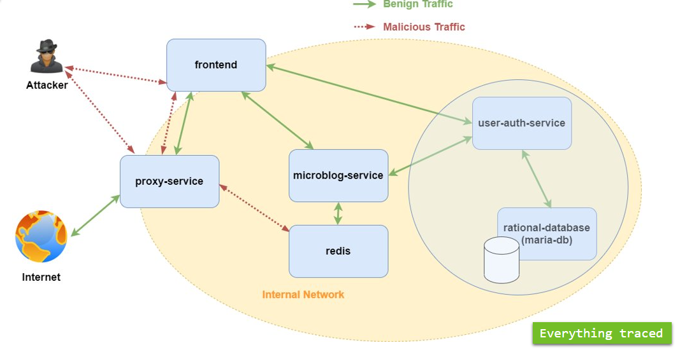

#  Vogelgrippe

A SSRF vulnerable twitter-clone consisting of several microservices designed to run on Kubernetes.
It comes with Jaeger traces and a bunch of vulnerabilities built-in.

It allows users to

- register / login (without any passwords)
- post text
- post URLs with URL preview
- view global or personalized timelines
- view user profiles
- follow other users

## Architecture

Vogelgrippe consists of four main services, a load generator, two databases, and Jaeger for tracing:

| Service                                  | Language        | Description                                                                                                  |
| ---------------------------------------- | --------------- | ------------------------------------------------------------------------------------------------------------ |
| [frontend](./frontend)                   | Node.js Express | Serves HTML to the user to interact with the application                                                     |
| [microblog-service](./microblog-service) | Java Spring     | Serves REST API for frontend, saves data into redis                                                          |
| [proxy-service](./proxy-service)         | Java Spring     | Serves REST API for proxying requests from frontend (vulnerable to SSRF; no sanitization on the entered URL) |
| [user-auth-service](./user-auth-service) | Node.js Express | Serves REST API for authenticating users with JWT tokens (vulnerable to JWT key confusion)                   |
| [loadgenerator](./loadgenerator)         | Python Locust   | Creates synthetic user traffic                                                                               |
| redis                                    |                 | Key-value store that holds all user data (except authentication-related stuff)                               |
| maria-db                                 |                 | Relational database that holds user and token data                                                           |
| jaeger                                   |                 | The [Jaeger](https://www.jaegertracing.io/) stack for distributed tracing                                    |



## Running on minikube

This is the recommended way of running Vogelgrippe and requires you to have [minikube](https://minikube.sigs.k8s.io/docs/) installed.

1.  **Install prerequisites**

    Follow the instructions to install the following on your system:

    * [kubectl](https://kubernetes.io/docs/tasks/tools/)
    * [minikube](https://minikube.sigs.k8s.io/docs/start/)
    * [helm](https://helm.sh/docs/intro/install/)
    * [skaffold](https://skaffold.dev/docs/install/)

2.  **Start a new or existing minikube cluster with the ingress add-on enabled**

    This will create a new minikube profile (i.e. cluster) named "vogelgrippe".

    ```
    minikube start --addons=ingress --profile vogelgrippe
    ```

3.  **Install MariaDB**

    Add the Helm repo and add the chart for MariaDB.

    ```
    helm repo add bitnami https://charts.bitnami.com/bitnami
    helm install mariadb-release bitnami/mariadb
    ```

4.  **Install [Jaeger](https://www.jaegertracing.io/)**

    Add the Helm repo and add the chart for Jaeger.

    ```
    helm repo add jaegertracing https://jaegertracing.github.io/helm-charts
    helm install jaeger-operator jaegertracing/jaeger-operator
    ```

    After installing the operator, apply it to your running cluster

    ```
    kubectl apply -f k8s-manifests/jaeger.yaml
    ```

    > Note: Make sure to name your Jaeger instance `jaeger` or
    > adjust all the `JAEGER_AGENT_HOST` environment variables in
    > `/k8s-manifests` to be of format `{YOUR-NAME}-agent`

5.  **Run the Vogelgrippe application with [Skaffold](https://skaffold.dev/)**

    On Linux, use the following

    ```
    eval $(minikube -p vogelgrippe docker-env)
    skaffold run --detect-minikube
    ```

    On Windows, use the following with PowerShell

    ```
    & minikube -p vogelgrippe docker-env | Invoke-Expression
    skaffold run --detect-minikube
    ```

6.  **(Optionally) Expose the application to your local machine**

    To access the frontend, you can use port-fowarding.
    This is the recommended way as exposing the service to external traffic would be a bad idea.

    ```
    # exposes the frontend on localhost:3000
    kubectl port-forward service/vogelgrippe-frontend 3000:80
    ```

    To make non-blind SSRF exploits, you can expose the proxy-service as well.
    This would be common practice with applications where the browser makes the requests (like Angular / React / Vue etc.).

    ```
    # exposes the proxy-service on localhost:8081
    kubectl port-forward service/vogelgrippe-proxy-service 8081:80
    ```

7.  **(Optionally) Expose the application to the internet**

    Make a file `ingress.yaml` where you specify an ingress to the frontend with your public hostname.

    ```
    apiVersion: networking.k8s.io/v1
    kind: Ingress
    metadata:
      name: vogelgrippe-ingress
    spec:
      rules:
        - host: put.your.external.hostname.here.com
          http:
            paths:
              - path: /
                pathType: Prefix
                backend:
                  service:
                    name: vogelgrippe-frontend
                    port:
                      number: 80
    ```

    Apply it like so

    ```
    kubectl apply -f ingress.yaml
    ```

    Finally, you have to forward requests from your machine on port 80 to your minikube on port 80.
    One way to do this is with the help of `socat` that you can start in a background `tmux` sessions.
    Make sure that your local firewall also allows connections on port 80, if you have one.

    ```
    sudo socat TCP-LISTEN:80,fork TCP:$(minikube ip):80
    ```

    > Note: This will not expose the proxy-service.

## Running locally

### Requirements

Beside the microservices, a Jaeger deployment is recommended as all the services send traces.

For setting up Jaeger, please see their [documentation](https://www.jaegertracing.io/docs/1.20/getting-started/).
The simplest way to start all needed Jaeger components is with Docker:

```
docker run -d --name jaeger \
  -e COLLECTOR_ZIPKIN_HTTP_PORT=9411 \
  -p 5775:5775/udp \
  -p 6831:6831/udp \
  -p 6832:6832/udp \
  -p 5778:5778 \
  -p 16686:16686 \
  -p 14268:14268 \
  -p 14250:14250 \
  -p 9411:9411 \
  jaegertracing/all-in-one:1.20
```

### Start microservices

Follow instructions in the READMEs of the individual services to run them locally.

- [frontend](./frontend)
- [microblog-service](./microblog-service)
- [proxy-service](./proxy-service)
- [user-auth-service](./user-auth-service)
- [loadgenerator](./loadgenerator)
