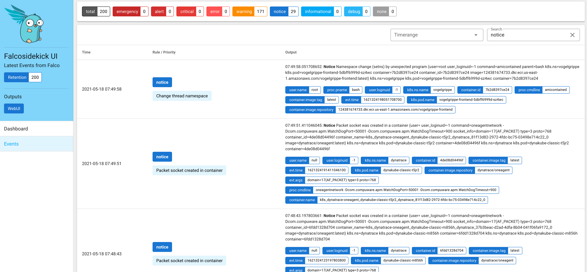

# Falco

> The cloud-native runtime security project, is the de facto Kubernetes threat detection engine.

[Falco](https://falco.org/) was created by Sysdig in 2016 and is the first runtime security project to join CNCF as an incubation-level project. Falco detects unexpected application behavior and alerts on threats at runtime.

## ⚙️ Installation

Use the `falco` profile when calling Skaffold.

```sh
skaffold run -p falco
```

## 🖥️ Usage

1. Port-forward Falcosidekick UI

```sh
kubectl port-forward service/falco-falcosidekick-ui 27017:2802
```

2. Execute a command which triggers Falco

```sh
export UNGUARD_FRONTEND=$(kubectl get pod -n=unguard -l app=unguard-frontend -o jsonpath={.items..metadata.name})
kubectl exec -i -t -n unguard $UNGUARD_FRONTEND -c frontend "--" sh -c "clear; (bash || ash || sh)"

# the next commands are run in the container
cat /etc/shadow
# amicontained is a tool to check whether the shell is a containerized environment.
cd /tmp; curl -L -o amicontained https://github.com/genuinetools/amicontained/releases/download/v0.4.7/amicontained-linux-amd64; chmod 555 amicontained; ./amicontained
```

3. Open [localhost:27017/ui/#/events](localhost:27017/ui/#/events)


