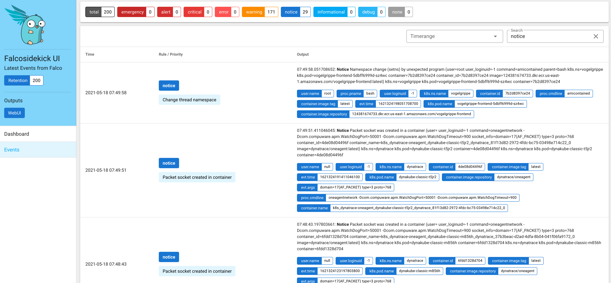

# Falco

1. Port-forward Falcosidekick UI

```sh
kubectl port-forward service/falco-falcosidekick-ui 27017:2802
```

2. Execute a command which triggers Falco

```sh
export VOGELGRIPPE_FRONTEND=$(kubectl get pod -n=vogelgrippe -l app=vogelgrippe-frontend -o jsonpath={.items..metadata.name})
kubectl exec -i -t -n vogelgrippe $VOGELGRIPPE_FRONTEND -c frontend "--" sh -c "clear; (bash || ash || sh)"

# the next commands are run in the container
cat /etc/shadow
# amicontained is a tool to check whether the shell is a containerized environment.
cd /tmp; curl -L -o amicontained https://github.com/genuinetools/amicontained/releases/download/v0.4.7/amicontained-linux-amd64; chmod 555 amicontained; ./amicontained
```

3. Open [localhost:27017/ui/events](localhost:27017/ui/events)

