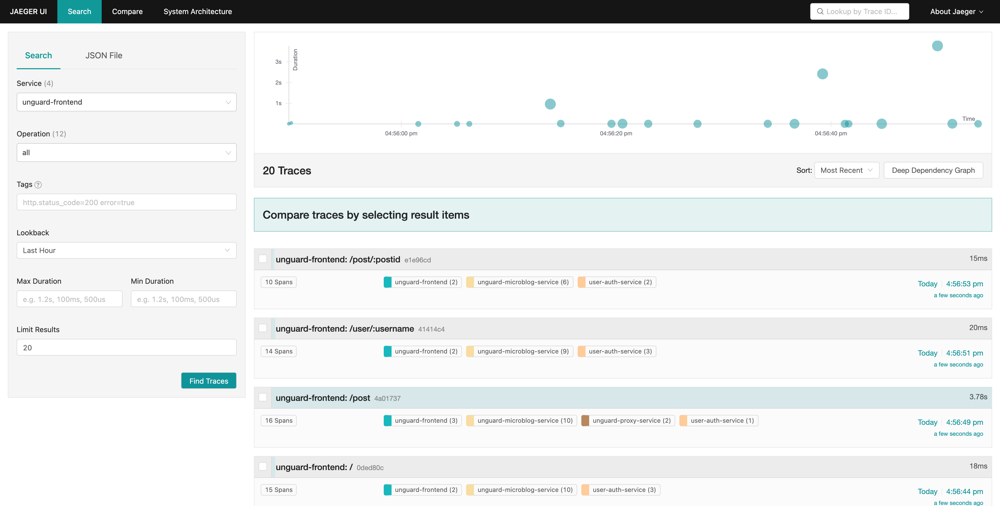

# Tracing

Most of the services contain different jaeger-client libraries to export traces that can be collected using e.g. Jaeger.

## Enable tracing in services

By using the default deployment, either using Skaffold or Helm, tracing would be disabled for all services. To enable it, the
corresponding environment variables has to be set. This can be done in two ways:

> **Note:** Tracing is configured for Jaeger by default. If you want to use a different service the values have to be adopted.

1. Using Skaffold with specifying the `tracing` profile during deployment:
    ```sh
    skaffold run -p tracing
    ```
2. Using Helm and passing the values file containing the necessary configuration with `-f ./chart/tracing.yaml` \
   See in the Unguard Chart [README](../chart/README.md#tracing-and-jaeger)

# Jaeger Installation Guide

This document explains how to install Jaeger tracing using Helm to the cluster.

1. Add Jaegertracing chart repo
   ```sh
    helm repo add jaegertracing https://jaegertracing.github.io/helm-charts
   ```

## Install Jaeger

1. For local development
    1. Install Jaeger (takes a couple of minutes)
       ```sh
        helm install jaeger jaegertracing/jaeger --version 0.71.14 --wait --namespace unguard --create-namespace --values ./docs/jaeger/jaeger-otlp-values.yaml
       ```
    2. Install the Jaeger-Operator
       ```sh
        helm install jaeger-operator jaegertracing/jaeger-operator --version 2.22.0 --wait --namespace unguard --create-namespace
       ```
    3. Deploy the AllInOne image for local development
       ```sh
        kubectl apply -f ./k8s-manifests/jaeger/jaeger.yaml
       ```
2. For production
    1. Install Jaeger
        ```sh
        helm install jaeger jaegertracing/jaeger -f ./chart/jaeger.yaml --wait --namespace unguard --create-namespace
        ```

## Deploy Unguard with tracing and Jaeger enabled to Cluster.

See in the Unguard Chart [README](../chart/README.md#tracing-and-jaeger)

## 🖥️ Usage

1. Port-forward the Jaeger UI

    ```sh
    kubectl port-forward -n unguard service/jaeger-query 16686:16686
    ```

2. Open [localhost:16686](http://localhost:16686)

   

## Uninstall

1. Uninstall unguard, mariadb
   ```sh
    helm uninstall unguard -n unguard && helm uninstall unguard-mariadb -n unguard
   ```
2. Uninstall Jaeger
    1. For local development
        ```sh
        helm uninstall jaeger-operator -n unguard
        ```
    2. For production
        ```sh
        helm uninstall jaeger -n unguard
        ```

## License

Copyright 2023 Dynatrace LLC

Licensed under the Apache License, Version 2.0 (the "License");
you may not use this file except in compliance with the License.
You may obtain a copy of the License at

     http://www.apache.org/licenses/LICENSE-2.0

Unless required by applicable law or agreed to in writing, software
distributed under the License is distributed on an "AS IS" BASIS,
WITHOUT WARRANTIES OR CONDITIONS OF ANY KIND, either express or implied.
See the License for the specific language governing permissions and
limitations under the License.
