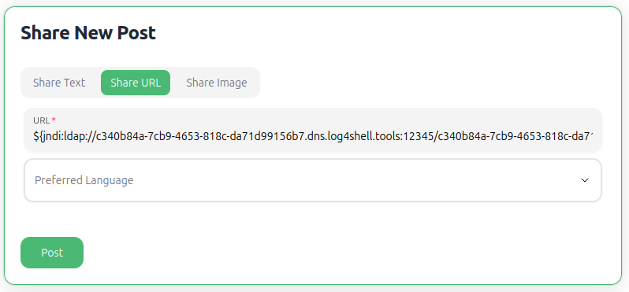
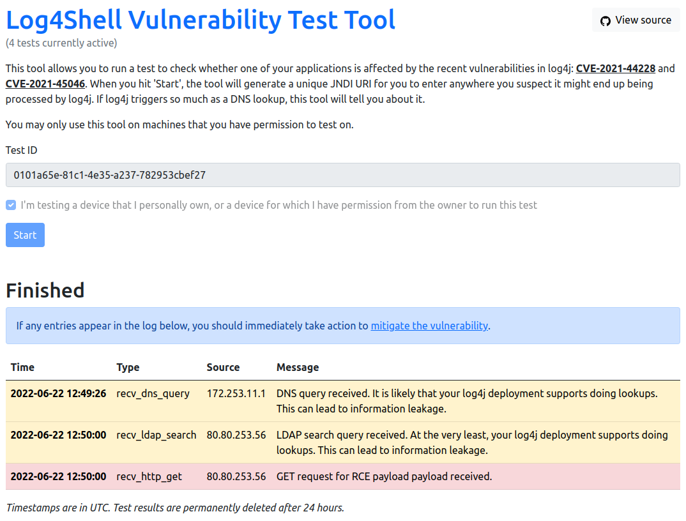

# Log4Shell

The JNDI features in some versions of the widespread used
[Apache Log4j 2 logging framework](https://logging.apache.org/log4j/2.x/) do not protect against attacker controlled
LDAP and other JNDI related endpoints. See [CVE-2021-44228](https://nvd.nist.gov/vuln/detail/CVE-2021-44228)
and [CVE-2021-45046](https://nvd.nist.gov/vuln/detail/CVE-2021-45046) for more details.

## Preconditions and Requirements

For a simple demo you need [unguard](../../../docs/DEV-GUIDE.md) up and running.

## Exploitation with Log4Shell Vulnerability Test Tool

1) Go to the [Log4Shell Vulnerability Test Tool](https://log4shell.tools/) and get a tailored lookup string to be 
entered into the demo application.
2) Go to [Unguard demo app](http://unguard.kube/ui/) and login.
3) Enter the copied string from the test tool above into the *Share URL* textbox and click *post*.

4) The test tool will pick up the lookup / GET request for the payload and show the results.

## Further Details

If you want to perform a more sophisticated setup to initiate a reverse shell connection, see this
[Log4Shell POC](https://github.com/kozmer/log4j-shell-poc).
