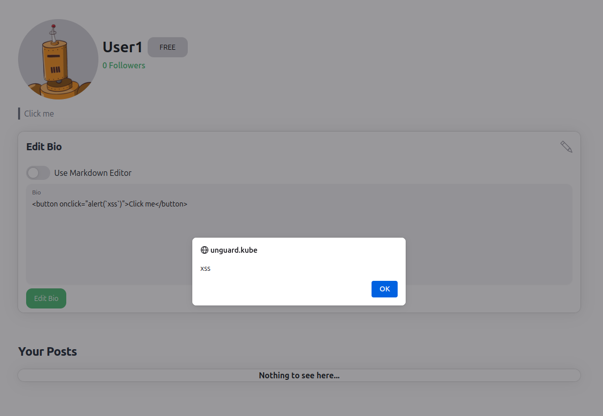

# Cross Site Scripting (XSS)

This term defines a type of attack where malicious scripts can be injected into websites. Generally speaking,
XSS occurs when a user sends malicious code, in most cases browser side scripts, to a different end user.

In Unguard, XSS can be exploited by inserting a script as your own bio.
The embedded script only will be executed for other users visiting your profile.
If you are on your own page, the textbox with your code will be visible.

## Preconditions and Requirements

For this exploit to work you need:

* [unguard](../../../docs/DEV-GUIDE.md) deployed and running

## Exploitation

To perform Cross Site Scripting, you need to be logged in and write valid HTML code into your bio and update it.

### w/o Toolkit CLI

To access the textbox you need to login and then access your profile by clicking the username in the top right corner,
then you need to click on `Profile` and there you can type a bio into the textbox.

Example:

```html

<button onclick="alert(`xss`)">Click me</button>
```

An important note: Rather than 'xss', the text of the alert is inside backticks: \`xss\`.
The reason for this is that with single quotation marks, there would be a syntax error in the SQL statement and the
attack wouldn't work. However, it is also possible to escape the single quotes differently, i.e. by using two of them:

```html

<button onclick="alert(''xss'')">Click me</button>
```

In this example, you are logged in as `User1`.


If you add the above text as your bio, then the following will be visible:


When clicking on the bio, an alert will appear:




## Further Details

* [Cross Site Scripting - OWASP](https://owasp.org/www-community/attacks/xss/)
