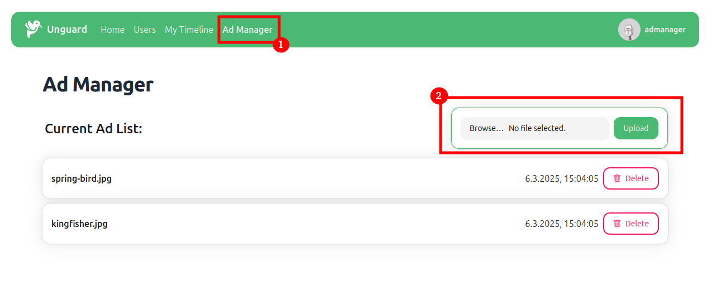

# Zip Slip

Zip Slip is a widespread arbitrary file overwrite critical vulnerability.
The vulnerability is exploited using a specially crafted archive that holds directory traversal filenames 
(e.g. `../../my-evil-file.js`).

The exact Zip Slip vulnerability in Unguard is contained in the third-party library *SharpCompress*, listed under
[CVE-2018-1002206](https://cve.mitre.org/cgi-bin/cvename.cgi?name=CVE-2018-1002206).

It can be used to overwrite the `site.js` JavaScript file that is loaded for clients accessing the ad-service with 
arbitrary code.

## Preconditions and Requirements

For this exploit to work you need:
* [unguard](../../../docs/DEV-GUIDE.md) deployed and running
* (optional) [unguard-exploit-toolkit](../../INSTALL.md) set up

## Exploitation

### Payload

To exploit the Zip Slip vulnerability, you can either use a pre-made zip file that already contains a malicious 
relative file path to the `../js/site.js` file, or you can manually craft your own malicious zip archive.
If you want to use the pre-made exploit file, it is located in [./payloads/exploit-ads.zip](./payloads/exploit-ads.zip).

To craft your own zip file with relative paths, simply create a normal zip archive with your preferred tool, and then
use [7-zip](https://www.7-zip.org/) to rename your malicious script to a relative path:

````shell
$ 7za rn my-zip-slip-archive.zip site.js ../js/site.js
````

Verify that it contains relative files by displaying the contents:

```shell
$ zip -sf my-zip-slip-archive.zip
Archive contains:
  ../js/site.js
  kingfisher.jpg
  spring-bird.jpg
Total 3 entries (836313 bytes)
```
This example zip file also contains some images, that are displayed by the ad-service.

### Exploit without Toolkit CLI

If you don't want to use the exploit toolkit, you need to manually log in into unguard using username/password 
`admanager:admanager`, clicking on the *Ad Manager* link in the top bar and uploading your malcious archive.




### Exploit with Toolkit CLI

For the exploit to work, you need to be logged in as a user with the AD_MANAGER Role. 
Log in as `admanager` (password is also admanager):

```shell
$ ug-exploit login admanager  
```

Afterwards, you need to upload the exploit archive:

```shell
$ ug-exploit ads-upload --archive-path ./exploits/zip-slip/payloads/exploit-ads.zip
```

### Restoring Original State

To restore the original state of the ad-service, upload `./payloads/original-ads.zip` using either the CLI or 
the Unguard UI.

To do that with the CLI, execute:

```shell
$ ug-exploit ads-upload --archive-path ./exploits/zip-slip/payloads/exploit-ads.zip
```

## Further Details

* [Zip Slip Vulnerability - Snyk Research](https://snyk.io/research/zip-slip-vulnerability)
