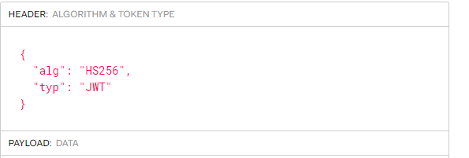
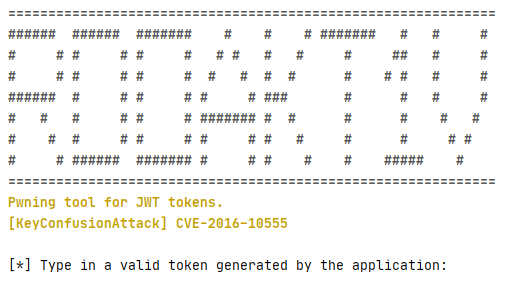

# Writeup / JWT-KeyConfusion Attack
##### By ProjectZero / CVE-2016–10555

## Vulnerability
The vulnerability is a key-confusion attack and exploits the 'algorithm' field in a json web token.  
The attack is possible, because before the bugfixes of the jwt-libraries most of them did not ensure that the token validation uses the same algorithm type as in the token signing process.  
So the algorithm, which was used to validate the token, was not forced by the backed, it was trusted by the user - who could freely choose the algorithm which the backend should use in the validation process by a field in the JWT-token. 

### Fix
The bug-fix was simple, by enforcing the signing function of the jwt-library to provide the algorithm and DO NOT use the algorithm provided by the user in the JWT token.  
Never trust the user with settings he needs no control of!
### Tokens
When creating JWT tokens there are different possibilites which algorithm to use, two possible algorithms which are used within this exploit are:
- RS256
- HS256

#### RS256:
For the signature RSA is used with a SHA256 combination. RSA has typically a public and private key-pair. Commonly for token-creation the private-key is used and for the token-validation the public-key of the key-pair. 

##### Correct usage:
Token-Creation:
```
jwt.encode({username: username, userid: userid}, jwtUtil.JwtPrivate, 'RS256')
```

Token-Validation:
```
decoded = jwt.decode(jwtToken, jwtUtil.JwtPublic, 'RS256')
```

#### HS256:
For the signature HMAC is used in combindation with SHA256. HMAC uses a private secret for the signing and validation process.

##### Correct usage:
Token-Creation:
```
jwt.encode({username: username, userid: userid}, JWT_SECRET, 'HS256')
```

Token-Validation:
```
decoded = jwt.decode(jwtToken, JWT_SECRET, 'HS256')
```

The advantage of using RS256 over HS256 is that the private-key is only used for token signing and every other entity with the public-key is able to validate the jwt tokens.

#### Vulnerable Token Creation:
The vulnerable token creation is attackable by using a key-confusion attack.  
Therefore the token creation/validation process has to be vulnerable by design(see below). The token has to use the RS256 algorithm for token-creation and should also use RS256 algorithm for token validation.  
If it was not enforced by the developer to use a certain algorithm while doing the token validation, the jwt-libraries would use the algorithm which is defined in the algorithm-JSON tag of the JWT-token.  

  
In this case the jwt-library would do the token-validation with an HS256 algorithm, although the token was created using a RS256 algorithm.
##### Vulnerable-Token-Creation:
```
jwt.encode({username: username, userid: userid}, JWT_PRIV, 'RS256')
```

##### Vulnerable-Token-Validation:
```
decoded = jwt.decode(jwtToken, jwtUtil.JwtPublic)
```
By forcing a validation with an HS256 algorithm and by keeping in mind that the validation-code expects an RS256 token and validates it with the RSA-public-key we can abuse this to create forged tokens with the publicly available RSA-public-key.  

The services takes our forged token validates it with its RSA-public-key but using our forced HS256 algorithm and therefore uses as secret the RSA-public-key.  

###### Pwned!
We are now able to create customized JWT-tokens with the RSA-public-key.  
And the vulnerable application validates our forged token(by confusing it with an HS256 signed token) with the RSA-public-key as secret.

## ExploitScript
To provide a handy tool which should guide the user through an successfull exploitation process, RdoAkt1v was created :)
##### Requirements:
- NodeJS
- Valid, original JWT-Token
- RSA-Public-Key
- New payload

The tool automatically forges the old token and signs it with the new customized payload.  

  


##### Usage:
- Paste in a valid RS256 token of the user-auth-service
- Provide your modified payload: Example ```{"username": "admin", "userid": 1}```  
Important! Use a valid username + userid of the user you want to impersonate.
- Copy the generated JWT-token and inject it into the application, you could use a cookie-manager to change the JWT-cookie directly in the browser for example.