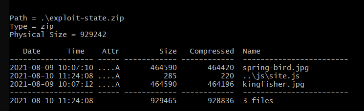

# Zip-Slip - SharpCompress
##### By ProjectZero / CVE-2018-1002206

## Overview
Zip-Slip occur in Zip-libraries like SharpCompress which intend to compress multiple data to one archive (e.g. zip, 7zip, ...)
or extract files out of a given archive.

## Vulnerability
A Zip-Slip describes the possibility to overwrite files outside the folder, where the archive-files should be extract.
The exploits use directory traversal filenames in a given archive (e.g. ```../my-evil-file.js```)

### Fix
The library which handles the export have to check, if the resolved destination path of each file (i.e. ```/my-evil-file.js``` instead of ```/test/../my-evil-file.js```) includes the chosen destination path in it.

A simple example how the fix could look like is given below:
```c#
if (!destdir.StartsWith(fullDestinationDirectoryPath))
{
    throw new ExtractionException("Entry is trying to create a directory outside of the destination directory.");
}
```

### path traversal archive
Since operating system normally not allow dots or slashes in filename, the filename has to be changed with a command
line tool, after the archive has been created.
With such tools like [7-zip](https://www.7-zip.org/) it's possible to name a file for path traversal like
followed:
````
7za rn ./expliot-ads.zip site.js ../js/site.js
````
In this case the command ```rn``` (rename) was executed on Windows in the directory where the ```7za.exe``` as well as
the ```exploit-ads.zip``` was located. The ```exploit-ads.zip``` contained two images, and a file called ```site.js```.
This file gets renamed to ```../js/site.js```

Note that the archive has to be viewed with a compatible zip viewer to see these files with relative paths.
The archive ```exploit-state.zip``` is displayed below:




## ExploitScript
A python tool was created for handling such exploit like zip slip at Unguard more easily.
The tool can be found under ```/exploits/tool```.

The zip slip exploit can also be executed manually by simple logging in as ```admanager```, selecting the
```Ad Manager``` section in the UI and uploading a vulnerable archive

##### Usage:
For executing the zip slip exploit with the exploitation tool, have a look at the README in exploits/tool.